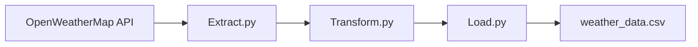

# 🌦️ SA Weather ETL Pipeline

<p align="center">


</p>

<p align="center">
A modern Python ETL pipeline that collects <strong>real-time weather data</strong> for major South African cities, transforms it into clean structured data, and exports it into CSV for analysis and reporting.
</p>

---

# 📖 Table of Contents

* Overview
* Features
* Architecture
* Pipeline Workflow
* Project Structure
* Tech Stack
* Installation
* Usage
* Sample Output
* Dataset
* Future Improvements
* Contributing
* Author
* License

---

# 🚀 Overview

This project demonstrates the core concepts of **Data Engineering** by implementing an ETL (Extract, Transform, Load) pipeline.

The application connects to the **OpenWeatherMap API**, retrieves live weather information, cleans and restructures the raw JSON data, and stores the results as a CSV dataset ready for analytics or dashboarding.

### 🌍 Cities Currently Supported

* Johannesburg
* Pretoria
* Durban
* Cape Town

---

# ✨ Features

✅ Real-time weather data collection

✅ Automated ETL workflow

✅ Clean and structured CSV output

✅ Modular Python architecture

✅ Easy to extend with more cities

✅ Beginner-friendly Data Engineering project

---

# 🏗️ Pipeline Architecture

```text
                 SA WEATHER ETL PIPELINE

         🌐 OpenWeatherMap API
                    │
                    ▼
              📡 EXTRACT DATA
          Retrieve Raw JSON Response
                    │
                    ▼
            🔧 TRANSFORM DATA
      Clean • Filter • Format • Rename
                    │
                    ▼
               💾 LOAD DATA
          Export to CSV File
                    │
                    ▼
          📊 Ready for Analytics
```

---

# 🔄 Workflow Diagram



---

# 📁 Project Structure

```text
sa-weather-etl-pipeline/
│
├── weather_etl/
│   ├── extract.py
│   ├── transform.py
│   ├── load.py
│   └── pipeline.py
│
├── output/
│   └── weather_data.csv
│
├── .gitignore
├── README.md
└── requirements.txt
```

---

# 🛠️ Tech Stack

| Technology         | Purpose                   |
| ------------------ | ------------------------- |
| Python             | Core programming language |
| Requests           | API communication         |
| CSV                | Data storage              |
| OpenWeatherMap API | Weather data source       |
| Git & GitHub       | Version control           |

---

# ⚙️ Installation

## 1️⃣ Clone the repository

```bash
git clone https://github.com/YOUR_USERNAME/sa-weather-etl-pipeline.git

cd sa-weather-etl-pipeline
```

---

## 2️⃣ Create a virtual environment

Linux/macOS

```bash
python3 -m venv .venv

source .venv/bin/activate
```

Windows

```bash
python -m venv .venv

.venv\Scripts\activate
```

---

## 3️⃣ Install dependencies

```bash
pip install -r requirements.txt
```

or

```bash
pip install requests
```

---

## 4️⃣ Configure your API key

Create an account at:

https://openweathermap.org/api

Then update:

```python
API_KEY = "YOUR_API_KEY"
```

inside

```text
weather_etl/extract.py
```

---

# ▶️ Running the Pipeline

```bash
cd weather_etl

python pipeline.py
```

---

# 📷 Example Console Output

```text
==================================================
SA WEATHER ETL PIPELINE
==================================================

📡 STEP 1 : EXTRACT

✅ Johannesburg

✅ Pretoria

✅ Durban

✅ Cape Town

🔧 STEP 2 : TRANSFORM

✅ Formatting timestamps

✅ Cleaning JSON

✅ Selecting required fields

💾 STEP 3 : LOAD

✅ weather_data.csv created

==================================================

🎉 PIPELINE COMPLETED SUCCESSFULLY
```

---

# 📄 Example CSV Output

| City         | Temperature | Humidity | Weather | Wind Speed |
| ------------ | ----------: | -------: | ------- | ---------: |
| Johannesburg |      16.4°C |      54% | Clouds  |        3.2 |
| Pretoria     |      18.1°C |      49% | Clear   |        2.6 |
| Durban       |      22.5°C |      71% | Rain    |        4.3 |
| Cape Town    |      15.0°C |      63% | Clear   |        5.1 |

---

# 📊 Dataset Fields

| Field            | Description            |
| ---------------- | ---------------------- |
| city             | City name              |
| country          | Country code           |
| temperature_c    | Current temperature    |
| feels_like_c     | Feels-like temperature |
| temp_min_c       | Minimum temperature    |
| temp_max_c       | Maximum temperature    |
| humidity_percent | Humidity               |
| wind_speed_mps   | Wind speed             |
| condition        | Weather description    |
| extracted_at     | Extraction timestamp   |

---

# 💡 Why I Built This

I created this project to strengthen my understanding of **Data Engineering fundamentals**, specifically the ETL process. It helped me gain practical experience working with external APIs, transforming raw data into structured datasets, and building modular Python applications.

This project also serves as a foundation for future enhancements such as database integration, workflow orchestration, and data visualization.

---

# 🚀 Future Improvements

* [ ] PostgreSQL integration
* [ ] Apache Airflow scheduling
* [ ] Docker support
* [ ] Data quality validation
* [ ] Logging
* [ ] Unit tests
* [ ] Dashboard using Power BI
* [ ] Interactive visualisations
* [ ] Support all South African provinces

---

# 🤝 Contributing

Contributions are welcome!

If you'd like to improve this project:

1. Fork the repository
2. Create a feature branch
3. Commit your changes
4. Push to GitHub
5. Open a Pull Request

---

# 🐛 Troubleshooting

### API returns 401

Your API key is missing or invalid.

---

### CSV not generated

Ensure:

* Internet connection is available
* API key is correct
* `output/` folder exists

---

### ModuleNotFoundError

Install dependencies:

```bash
pip install requests
```

---

# 👨‍💻 Author

## **Letsoenyo Clen Bongane**

Aspiring **Data Engineer** passionate about building scalable data pipelines and transforming raw data into meaningful insights.

**Connect with me**

* 💼 LinkedIn: https://linkedin.com/in/Bongane_Clen
* 💻 GitHub: https://github.com/Bongane0606

---

# ⭐ Support

If you found this project useful, consider giving it a ⭐ on GitHub.

It helps others discover the project and motivates future improvements.

---

# 📄 License

This project is licensed under the **MIT License**.

Feel free to use, modify, and distribute it in accordance with the license terms.
