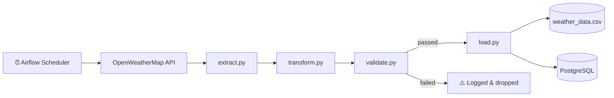

# 🌦️ SA Weather ETL Pipeline

<p align="center">


</p>

<p align="center">
A production-shaped Python ETL pipeline that collects <strong>real-time weather data</strong> for a city in every South African province, validates it, and loads it into both <strong>CSV</strong> and <strong>PostgreSQL</strong> — orchestrated on a schedule by <strong>Apache Airflow</strong>, and fully <strong>containerized with Docker</strong>.
</p>

<p align="center">
  <a href="#-overview">Overview</a> •
  <a href="#-features">Features</a> •
  <a href="#%EF%B8%8F-pipeline-architecture">Architecture</a> •
  <a href="#%EF%B8%8F-installation--running">Installation</a> •
  <a href="#-testing">Testing</a> •
  <a href="#-future-improvements">Roadmap</a>
</p>

---

# 📖 Table of Contents

* [Overview](#-overview)
* [Features](#-features)
* [Pipeline Architecture](#%EF%B8%8F-pipeline-architecture)
* [Workflow Diagram](#-workflow-diagram)
* [Project Structure](#-project-structure)
* [Tech Stack](#%EF%B8%8F-tech-stack)
* [Installation & Running](#%EF%B8%8F-installation--running)
* [Testing](#-testing)
* [Sample Output](#-sample-output)
* [Dataset Fields](#-dataset-fields)
* [Why I Built This](#-why-i-built-this)
* [Future Improvements](#-future-improvements)
* [Troubleshooting](#-troubleshooting)
* [Contributing](#-contributing)
* [Author](#-author)
* [License](#-license)

---

# 🚀 Overview

This project implements a full **Extract → Transform → Validate → Load** pipeline for South African weather data.

It connects to the **OpenWeatherMap API**, retrieves live weather for one representative city per province, cleans and restructures the raw JSON, runs it through data-quality checks, and writes the results to **CSV** and **PostgreSQL** simultaneously. The whole thing runs inside **Docker**, and **Apache Airflow** schedules it to run automatically every 6 hours.

<details>
<summary><strong>🗺️ Cities currently covered (click to expand — one per province)</strong></summary>

| Province | City |
|---|---|
| Gauteng | Johannesburg |
| Western Cape | Cape Town |
| KwaZulu-Natal | Durban |
| Eastern Cape | Port Elizabeth (Gqeberha) |
| Free State | Bloemfontein |
| Limpopo | Polokwane |
| Mpumalanga | Nelspruit (Mbombela) |
| North West | Mahikeng |
| Northern Cape | Kimberley |

</details>

---

# ✨ Features

✅ Real-time weather data collection for all 9 provinces

✅ Automated, scheduled ETL workflow (Apache Airflow, every 6 hours)

✅ Dual-sink loading — CSV **and** PostgreSQL, in the same run

✅ Data quality validation layer before anything gets loaded

✅ Structured logging to console + dated log files

✅ 14 unit tests covering transform and validation logic

✅ Fully containerized with Docker & Docker Compose

✅ Modular Python architecture, easy to extend with more cities/fields

---

# 🏗️ Pipeline Architecture

```text
                        SA WEATHER ETL PIPELINE

              ⏰ Airflow (scheduled every 6 hours)
                              │
                              ▼
                🌐 OpenWeatherMap API (9 provinces)
                              │
                              ▼
                       📡 EXTRACT
                 Retrieve raw JSON per city
                              │
                              ▼
                      🔧 TRANSFORM
             Clean • Filter • Format • Rename
                              │
                              ▼
                      🔍 VALIDATE
         Range checks • required fields • consistency
                              │
                ┌─────────────┴─────────────┐
                ▼                           ▼
          💾 LOAD → CSV              💾 LOAD → PostgreSQL
                │                           │
                └─────────────┬─────────────┘
                              ▼
                     📊 Ready for analytics
```

---

# 🔄 Workflow Diagram



---

# 📁 Project Structure

<details>
<summary><strong>Click to expand full tree</strong></summary>

```text
sa-weather-etl-pipeline/
│
├── weather_etl/
│   ├── extract.py        # Pulls raw weather JSON per province
│   ├── transform.py      # Cleans & reshapes into flat records
│   ├── validate.py       # Data quality checks (ranges, required fields)
│   ├── load.py           # Writes to CSV and PostgreSQL
│   ├── db.py             # PostgreSQL connection & table setup
│   ├── logger.py         # Console + file logging
│   └── pipeline.py       # Orchestrates the 4 stages end-to-end
│
├── dags/
│   └── weather_pipeline_dag.py   # Airflow DAG, runs pipeline.py every 6h
│
├── docker/
│   └── airflow/                  # Airflow-specific Dockerfile
│
├── tests/
│   └── test_pipeline.py          # 14 unit tests (transform + validation)
│
├── output/
│   └── weather_data.csv
│
├── logs/
│   └── pipeline_YYYY-MM-DD.log
│
├── Dockerfile             # App image
├── docker-compose.yml     # postgres + app + airflow (webserver/scheduler/init)
├── conftest.py
├── .env                   # DB + API credentials (not committed)
├── requirements.txt
└── README.md
```

</details>

---

# 🛠️ Tech Stack

| Technology | Purpose |
|---|---|
| Python 3.10 | Core programming language |
| Requests | API communication |
| psycopg2 | PostgreSQL driver |
| python-dotenv | Environment variable management |
| PostgreSQL 15 | Persistent structured storage |
| Apache Airflow | Scheduling & orchestration |
| Docker & Docker Compose | Containerization |
| pytest | Unit testing |
| CSV | Lightweight flat-file output |
| OpenWeatherMap API | Weather data source |
| Git & GitHub | Version control |

---

# ⚙️ Installation & Running

<details open>
<summary><strong>🐳 Option A — Docker Compose (recommended, runs everything)</strong></summary>

**1. Clone the repository**
```bash
git clone https://github.com/Bongane0606/sa-weather-etl-pipeline.git
cd sa-weather-etl-pipeline
```

**2. Create a `.env` file** in the project root:
```env
DB_HOST=postgres
DB_PORT=5432
DB_NAME=weather
DB_USER=weather_user
DB_PASSWORD=your_password
API_KEY=your_openweathermap_api_key
AIRFLOW_UID=50000
```

**3. Spin everything up**
```bash
docker compose up -d
```
This starts: the weather Postgres DB, the pipeline app container, and a full Airflow stack (metadata DB, webserver, scheduler).

**4. Open the Airflow UI**
```
http://localhost:8080   (login: admin / admin)
```
Find the `sa_weather_etl_pipeline` DAG and switch it on — it will then run automatically every 6 hours.

</details>

<details>
<summary><strong>🐍 Option B — Run the pipeline locally (no Docker/Airflow)</strong></summary>

**1. Create a virtual environment**
```bash
python3 -m venv venv
source venv/bin/activate   # Windows: venv\Scripts\activate
```

**2. Install dependencies**
```bash
pip install -r requirements.txt
```

**3. Set up `.env`** with your local Postgres details and API key (same format as above, `DB_HOST=localhost`).

**4. Run it**
```bash
cd weather_etl
python pipeline.py
```

</details>

---

# 🧪 Testing

```bash
pytest tests/
```

14 unit tests currently cover:
- `transform.py` — correct field mapping, city names, required-field presence
- `validate.py` — range checks (temperature, humidity), missing fields, min > max detection, batch filtering

---

# 📷 Sample Output

<details>
<summary><strong>Console / log output</strong></summary>

```text
==================================================
SA WEATHER ETL PIPELINE STARTED
==================================================
STEP 1: EXTRACTING data from API...
✅ Johannesburg   ✅ Cape Town     ✅ Durban
✅ Port Elizabeth ✅ Bloemfontein  ✅ Polokwane
✅ Nelspruit      ✅ Mahikeng      ✅ Kimberley

STEP 2: TRANSFORMING raw data...
✅ Formatting timestamps   ✅ Cleaning JSON   ✅ Selecting required fields

STEP 3: VALIDATING data quality...
✅ 9 passed, 0 failed

STEP 4: LOADING data...
✅ weather_data.csv updated
✅ 9 records inserted into PostgreSQL
==================================================
PIPELINE COMPLETED SUCCESSFULLY
==================================================
```

</details>

<details>
<summary><strong>Example CSV / PostgreSQL row shape</strong></summary>

| city | province | country | temperature_c | feels_like_c | temp_min_c | temp_max_c | humidity_percent | wind_speed_mps | condition | extracted_at |
|---|---|---|---:|---:|---:|---:|---:|---:|---|---|
| Johannesburg | Gauteng | ZA | 18.5 | 17.2 | 15.0 | 21.0 | 65 | 3.5 | clear sky | 2026-09-09 08:30:00 |
| Cape Town | Western Cape | ZA | 14.0 | 13.0 | 11.0 | 16.0 | 80 | 5.2 | light rain | 2026-09-09 08:30:00 |
| Durban | KwaZulu-Natal | ZA | 22.5 | 22.9 | 20.0 | 24.0 | 71 | 4.3 | scattered clouds | 2026-09-09 08:30:00 |

</details>

---

# 📊 Dataset Fields

| Field | Description |
|---|---|
| city | City name |
| province | South African province |
| country | Country code |
| temperature_c | Current temperature |
| feels_like_c | Feels-like temperature |
| temp_min_c | Minimum temperature |
| temp_max_c | Maximum temperature |
| humidity_percent | Humidity |
| wind_speed_mps | Wind speed |
| condition | Weather description |
| extracted_at | Extraction timestamp |

---

# 💡 Why I Built This

I created this project to strengthen my understanding of **Data Engineering fundamentals** — not just the ETL process itself, but the surrounding infrastructure a real pipeline needs: data quality validation, structured logging, a persistent database sink, scheduled orchestration, and containerization.

It started as a simple 4-city script and grew into a small but complete pipeline covering every South African province, with Airflow handling the schedule and Docker Compose handling the environment.

---

# 🚀 Future Improvements

* [x] PostgreSQL integration
* [x] Apache Airflow scheduling
* [x] Docker support
* [x] Data quality validation
* [x] Logging
* [x] Unit tests
* [x] Support all South African provinces
* [ ] Dashboard using Power BI
* [x] Interactive visualisations — HTML dashboard reading directly from `output/weather_data.csv`

---

# 🐛 Troubleshooting

<details>
<summary><strong>API returns 401</strong></summary>

Your `API_KEY` in `.env` is missing or invalid — check it against your OpenWeatherMap account.

</details>

<details>
<summary><strong>Pipeline can't connect to PostgreSQL</strong></summary>

- Running locally? Make sure Postgres is running and `DB_HOST=localhost`.
- Running via Docker Compose? `DB_HOST` should be `postgres`, and the `postgres` service must report healthy (`docker compose ps`).

</details>

<details>
<summary><strong>Airflow shows "no username" or init fails</strong></summary>

Don't override the Airflow container's entrypoint — it needs to register `AIRFLOW_UID` into `/etc/passwd` before running the init command. Let `airflow-init` run as defined in `docker-compose.yml`.

</details>

<details>
<summary><strong>CSV not generated</strong></summary>

Ensure:
- Internet connection is available
- API key is correct
- `output/` folder exists (created automatically on first run)

</details>

<details>
<summary><strong>ModuleNotFoundError</strong></summary>

```bash
pip install -r requirements.txt
```

</details>

---

# 🤝 Contributing

Contributions are welcome!

1. Fork the repository
2. Create a feature branch
3. Commit your changes
4. Push to GitHub
5. Open a Pull Request

---

# 👨‍💻 Author

## **Letsoenyo Clen Bongane**

Aspiring **Data Engineer** passionate about building scalable data pipelines and transforming raw data into meaningful insights.

**Connect with me**

* 💼 LinkedIn: https://linkedin.com/in/Bongane_Clen
* 💻 GitHub: https://github.com/Bongane0606

---

# ⭐ Support

If you found this project useful, consider giving it a ⭐ on GitHub — it helps others discover the project and motivates future improvements.

---

# 📄 License

This project is licensed under the **MIT License**. Feel free to use, modify, and distribute it in accordance with the license terms.